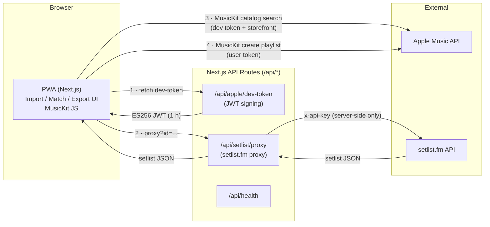
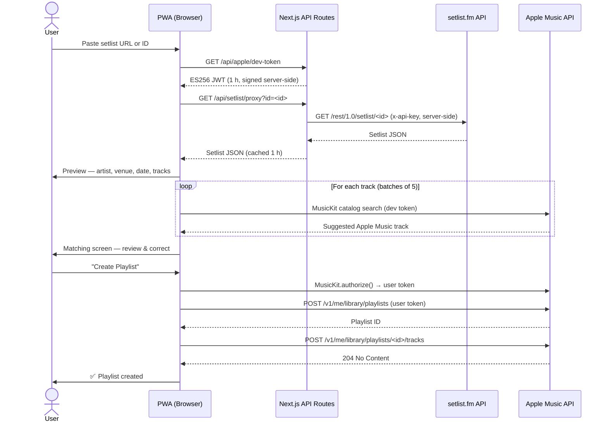

# Architecture Overview

## Goal

Import a setlist from setlist.fm (URL or ID) → preview and optionally correct track matches → create an Apple Music playlist in the user's account.

## Deployment Model

In this repo, the **web app** (Next.js) serves both the PWA and the API. The API is implemented as Next.js Route Handlers under `apps/web/src/app/api/`, which delegate to the shared logic in the `api` package (JWT signing, setlist proxy). There is no separate API server for local development or default deployment.

## Components and Data Flow



## Flows

1. **Import:** User enters setlist.fm URL or setlist ID → frontend calls our API proxy (`/api/setlist/proxy`) → proxy validates the ID and calls setlist.fm server-side (API key never leaves the server) → setlist data (artist, venue, date, tracks) is shown.
2. **Matching:** For each setlist entry, we derive a search query (track + artist, normalized). Apple Music search is done via MusicKit in the client (using our Developer Token from the API). User can correct or re-search.
3. **Export:** User confirms → MusicKit creates a playlist and adds the selected Apple Music track IDs in order.

### Main User Flow (Sequence)



## Token Handling

- **Apple Developer Token (JWT):** Minted server-side only in the `api` package; exposed via the Next.js route `GET /api/apple/dev-token`. Never shipped to the client in source; the client receives it at runtime. Short-lived (e.g. 1 hour); the client refreshes as needed. Concurrent refresh calls are deduplicated via a promise-singleton pattern (`apps/web/src/lib/musickit/token.ts`) to prevent redundant API requests during token expiry.
- **Apple User Token:** Obtained in the browser via MusicKit JS after user authorizes. Stays in the client; used for playlist create and catalog search on behalf of the user.
- **setlist.fm API key:** Kept server-side in the setlist proxy (`GET /api/setlist/proxy`). The client calls our proxy; we add the key, cache responses in memory (1 h TTL), and rate-limit (20 req/60 s per client IP).

## Matching Strategy

- **Normalization:** Strip "feat.", "live", extra punctuation, ( … ) segments for search. Logic lives in `packages/core` (e.g. `normalizeTrackName`).
- **Search:** "track name artist name" → Apple Music catalog search. First result or best match can be suggested; user can change. Auto-matching runs in batched parallel calls (groups of 5 via `Promise.allSettled`) to balance throughput and rate-limit headroom.
- **Fallbacks:** No match → show "No match"; user can search manually or skip.

## Error Cases and Rate Limits

- **setlist.fm:** Rate limits apply; the proxy caches and throttles. Backoff on 429.
- **Apple:** Token expiry → refresh Developer Token; user revoke → show re-auth in MusicKit.
- **Network:** Show clear errors; optional PWA offline support for already-loaded setlist (export still requires network).

## Caching

- setlist.fm responses are cached in the proxy (in-memory, 1 h TTL) to reduce calls and protect the API key. Successful proxy responses include `Cache-Control: private, max-age=3600`; errors return `no-store`.
- Apple catalog search results are cached client-side in a bounded LRU map (max 500 entries) to avoid duplicate requests during matching.
- The rate limiter (`apps/web/src/lib/rate-limit.ts`) has memory bounds: expired buckets are swept at 1 000 entries; a hard cap of 5 000 evicts oldest keys FIFO.
- **Next 16+:** Cache Components (`use cache`, PPR) can cache server-rendered setlist or config; see `docs/tech/cache-components.md`.

## Hooks Architecture

Client-side state is split into composable hooks, one per concern. The tree below shows how they nest inside their host components:

```
SetlistImportView
  useSetlistImportState   -- setlist data, loading, input history
  useFlowState            -- step machine (import / preview / matching / export)
    MatchingView
      useMatchingSuggestions  -- autoMatchAll (batched), setMatch, skipUnmatched
      useTrackSearch          -- manual search state, chooseTrack / skipTrack
    CreatePlaylistView
      useCreatePlaylistState  -- playlist creation, sessionStorage resume logic
```

- `useFlowState` is a minimal state machine; transitions are named (`goToPreview`, `goToExport`, etc.) so callers never set raw step values.
- `useMatchingSuggestions` owns the match list and exposes `autoMatchAll`, which processes tracks in batches of 5 with stale-run guards (`runIdRef`).
- `useTrackSearch` handles one-at-a-time manual search with its own run-ID guard and delegates selection back via `setMatch`.
- `useCreatePlaylistState` persists partial progress to `sessionStorage` so a failed add-tracks call can be resumed without re-creating the playlist.
- `MatchRowItem` is wrapped in `React.memo` to avoid re-renders when sibling rows change.
