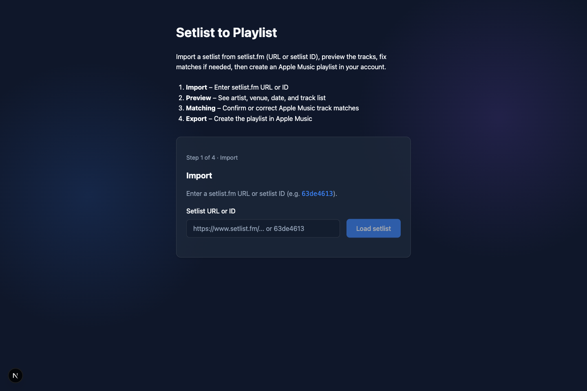
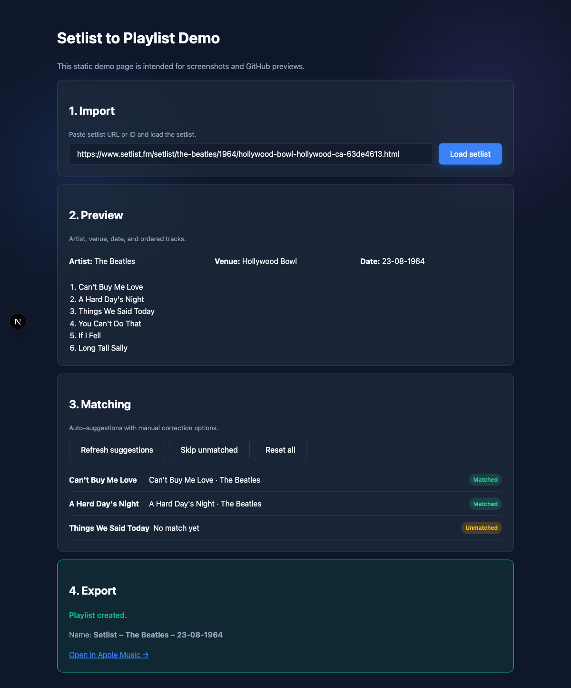
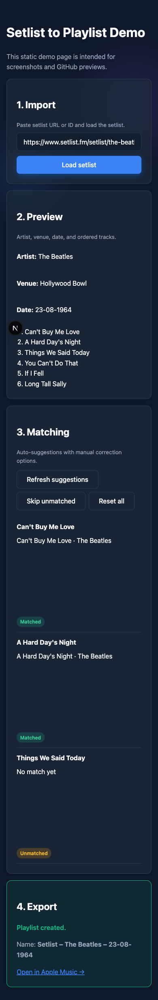

# Setlist to Playlist

A PWA that imports a setlist from [setlist.fm](https://www.setlist.fm) (by URL or setlist ID) and creates an **Apple Music** playlist in your account.

> **About this project**  
> This repository was built with **AI-assisted development** (Cursor, Codex, Kilo Code). From structure and docs to implementation and tests—all created with AI support. The approach follows the methodology documented in [Harness Engineering](https://openai.com/index/harness-engineering/).

## Quick Start

```bash
pnpm install
pnpm build
pnpm dev
```

Then open the web app at **http://localhost:3000**. The same process runs both the Next.js frontend and the API routes (Developer Token, setlist proxy, health); no separate API server is required for local development.

## Demo

- Live local demo route: `http://localhost:3000/demo`
- The `/demo` page is static and intended for reproducible screenshots/GitHub previews.

### Screenshots

#### App Home



#### Demo Flow (Desktop)



#### Demo Flow (Mobile)



### Prerequisites

- **Node.js** ≥ 20 (see `engines` in root `package.json`)
- **pnpm** (recommended; the repo uses a pnpm workspace)

### Environment

Copy `.env.example` to `.env` in the repo root and set:

- **Apple Music:** `APPLE_TEAM_ID`, `APPLE_KEY_ID`, `APPLE_PRIVATE_KEY` (for the Developer Token), and `NEXT_PUBLIC_APPLE_MUSIC_APP_ID` (MusicKit in the browser). See [docs/tech/apple-music.md](docs/tech/apple-music.md).
- **setlist.fm:** `SETLISTFM_API_KEY` (used only by the server-side proxy; never sent to the client). See [docs/tech/setlistfm.md](docs/tech/setlistfm.md).
- **Optional:** `NEXT_PUBLIC_API_URL` – base URL for API calls. Leave unset for same-origin (default when the app and API run together). Set only when the API is served from a different origin.
- **Production CORS:** `ALLOWED_ORIGIN` – required when the app is deployed; see [docs/tech/security.md](docs/tech/security.md) and `.env.example`.

## Monorepo Overview

| Path | Description |
|------|-------------|
| `apps/web` | Next.js PWA: Import → Preview → Matching → Export. Hosts API routes at `/api/*` (dev-token, setlist proxy, health). |
| `apps/api` | Shared serverless logic (JWT signing, setlist proxy handler). Used by the web app’s API routes; not run as a standalone server in this repo. |
| `packages/core` | Domain logic: setlist parsing, track matching, normalization (no UI). |
| `packages/shared` | Shared types, utils, constants. |
| `packages/ui` | Optional design system (placeholder). |
| `docs/` | Consolidated product spec (PRD), focused design docs, tech docs, ADR, quality findings. |

See [ARCHITECTURE.md](ARCHITECTURE.md) for data flow and [docs/index.md](docs/index.md) for the docs map.

## Project Structure

```
.
├── README.md
├── AGENTS.md
├── ARCHITECTURE.md
├── CONTRIBUTING.md
├── CHANGELOG.md
├── LICENSE
├── SECURITY.md
├── PRIVACY.md
├── TERMS.md
├── .env.example
├── .gitignore
├── .editorconfig
├── .prettierrc
├── eslint.config.mjs
├── package.json
├── pnpm-workspace.yaml
├── turbo.json
├── apps/
│   ├── web/                     # Next.js PWA + API routes
│   │   ├── src/
│   │   │   ├── app/
│   │   │   │   ├── api/          # Next.js API routes
│   │   │   │   │   ├── apple/dev-token/
│   │   │   │   │   ├── setlist/proxy/
│   │   │   │   │   └── health/
│   │   │   │   ├── layout.tsx
│   │   │   │   ├── page.tsx
│   │   │   │   ├── error.tsx
│   │   │   │   └── global-error.tsx
│   │   │   ├── features/
│   │   │   │   ├── setlist-import/
│   │   │   │   ├── matching/
│   │   │   │   └── playlist-export/
│   │   │   ├── lib/
│   │   │   ├── styles/
│   │   │   └── types/
│   │   ├── public/
│   │   │   ├── manifest.webmanifest
│   │   │   └── icons/
│   │   ├── tests/
│   │   └── package.json
│   └── api/                      # Shared API logic (used by web’s routes)
│       ├── src/
│       │   ├── routes/
│       │   │   ├── apple/dev-token.ts
│       │   │   ├── setlist/proxy.ts
│       │   │   └── health.ts
│       │   ├── middleware/
│       │   └── lib/
│       ├── tests/
│       └── package.json
├── packages/
│   ├── core/                     # Domain logic
│   │   ├── src/
│   │   │   ├── setlist/
│   │   │   ├── matching/
│   │   │   ├── apple/
│   │   │   └── index.ts
│   │   └── tests/
│   ├── shared/
│   │   ├── src/
│   │   │   ├── types/
│   │   │   ├── utils/
│   │   │   └── index.ts
│   │   └── tests/
│   └── ui/                       # Design system (optional)
│       └── src/
├── docs/
│   ├── index.md
│   ├── product-specs/          # PRD as single source
│   ├── design-docs/            # UX flows + pointers to design system master
│   ├── design-system/
│   ├── tech/
│   ├── adr/
│   └── code-inspection-findings.md
├── infra/
│   └── README.md                 # deploy/, nginx/, terraform/ reserved when needed
└── scripts/
    ├── seed-demo-setlists.ts
    └── export-diagnostics.ts
```

## Scripts

| Command | Description |
|--------|-------------|
| `pnpm install` | Install dependencies for all workspace packages. |
| `pnpm build` | Build all packages (Turbo: core, shared, api, then web). |
| `pnpm dev` | Start the Next.js dev server (web app and API routes). |
| `pnpm lint` | Run ESLint in all packages. |
| `pnpm test` | Run tests in all packages. |
| `pnpm format` | Format code with Prettier. |
| `pnpm format:check` | Check formatting without writing. |

Optional (run from repo root with `npx tsx`):

- **seed-demo-setlists:** `SETLISTFM_API_KEY=your_key npx tsx scripts/seed-demo-setlists.ts` – fetches demo setlists and writes `scripts/fixtures/demo-setlists.json` for local dev or tests.
- **export-diagnostics:** `npx tsx scripts/export-diagnostics.ts` or `npx tsx scripts/export-diagnostics.ts --out report.json` – exports non-sensitive env/config info for support or debugging (no secrets).
- **cleanup-repo:** `bash scripts/cleanup-repo.sh` – removes local non-source artifacts (logs, `.DS_Store`, build caches) without touching tracked source files.

## License

See [LICENSE](LICENSE). For privacy and terms, see [PRIVACY.md](PRIVACY.md) and [TERMS.md](TERMS.md).
